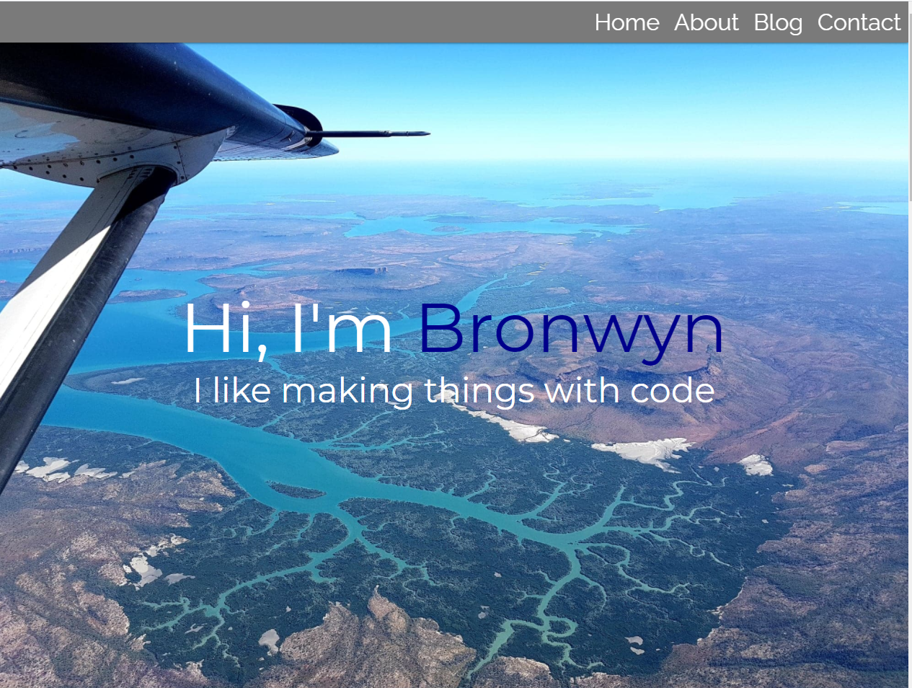
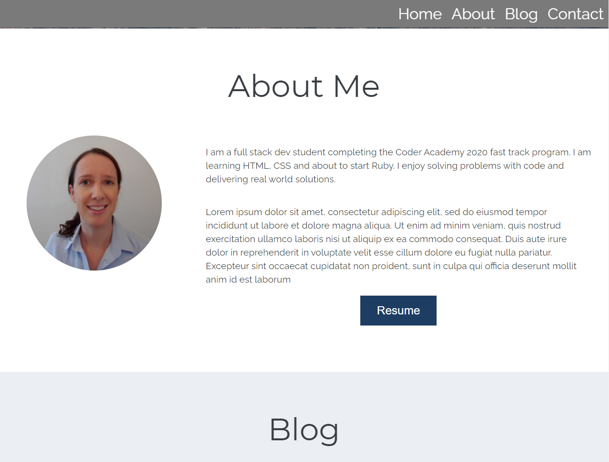
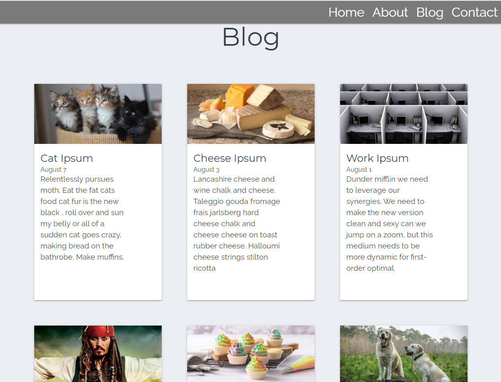
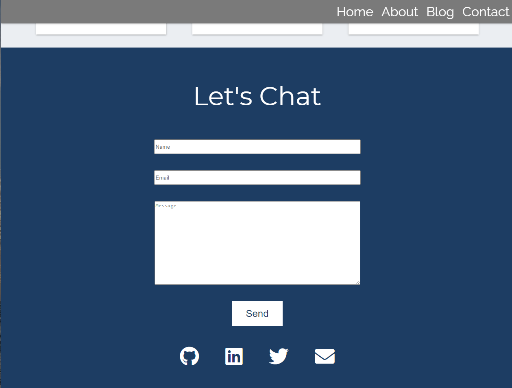

# Blog Site

# :information_source: About
This project was built to practise HTMl and SASS. It meets the requirements of Coder Academt T1A1 task.

Note: It was built using Loren ipsum text and images that are used purely for acedemic purposes. I do not necessary hold the copywrite licence for all these assets. 

## :rocket: Deployment

This project is currently deployed at: <https://bronwyn-blog-site.netlify.app/>

## :movie_camera: Demo

## :camera: Screen shots

## :bug: Contribution & Suggestions

Any bug fixes or contributions are welcome via a PR.
